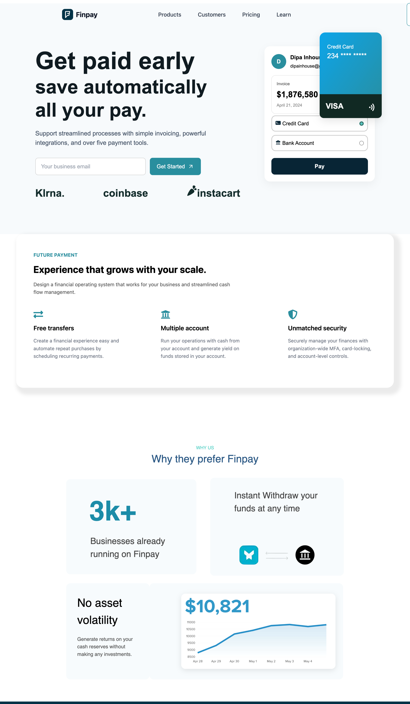

# Finpay Project For Web Design
## Features
- **Responsive Design**: Optimized for all screen sizes.

## Technologies Used
- **React**: For building the user interface.
- **CSS**: For styling and responsiveness.
- **React Icons**: For adding icons to the application.

## Screenshots
### Desktop View


## Installation

1. Clone the repository:
   ```bash
   git clone https://github.com/your-username/finpay-project.git
   ```
2. Navigate to the project directory:
   ```bash
   cd finpay-project
   ```
3. Install dependencies:
   ```bash
   npm install
   ```
4. Start the development server:
   ```bash
   npm run dev
   ```

## Folder Structure

```
Finpay-Project/
├── src/
│   ├── assests
│   ├── App.tsx
│   ├── index.css
│   └── ...
├── README.md
└── package.json
```

## Contributing

Contributions are welcome! Please fork the repository and submit a pull request.

## License

This project is licensed under the MIT License.

---
